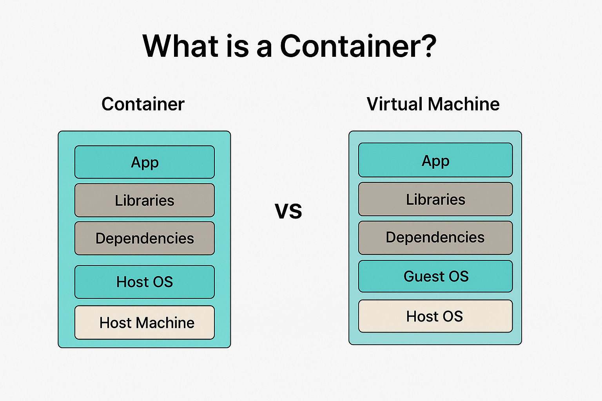
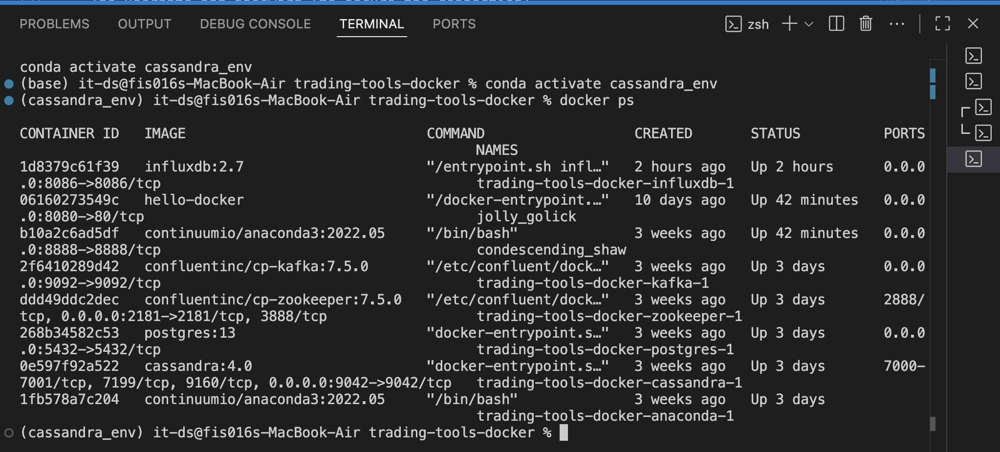
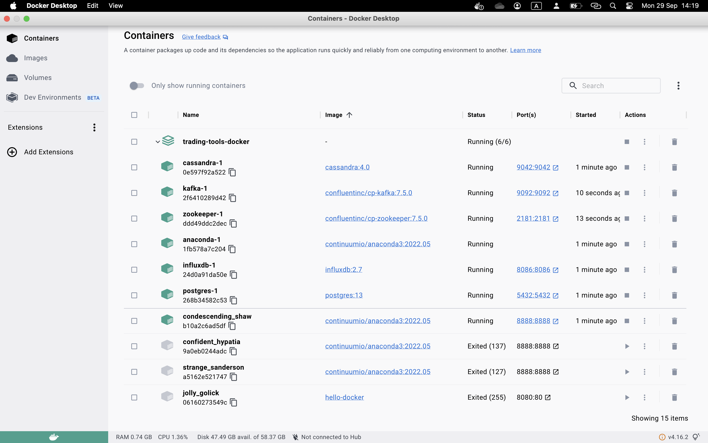

DevOps
Installation & Setup

___
1. Docker 
## 🐳 What is Docker?

Docker is an open source platform that helps you run any application inside a lightweight, isolated box called a container.
It's a tool that allows you to run programs or databases within containers.

🔹 The idea:
Instead of installing software (database, libraries, tools) directly on your device and encountering problems (for example, some libraries work for you but not for me), Docker puts everything ready and integrated inside its own container.

That means:
No more "works on my machine" issues.
You can run the same environment anywhere.

🎯 Why we use Docker?

Solve compatibility issues: The application works the same way for everyone.

- Portability: Run applications on any device.
The container itself runs on Windows, Mac, or Linux.

- Speed: Containers are lightweight and launch in seconds.

- Isolation: Each application is isolated from the others.

- Scalability: You can easily run thousands of containers.

- Efficiency: Your machine can handle up to 50 containers.

## 🐳 Steps to Install Docker 

1. Download Docker Desktop
Download Docker Desktop from Docker website.
After downloading,we ran the installation file.
2. Verify that Docker is running
We opened Terminal and typed:
docker --version
If you see the Docker version : the installation was successful.
3. Run Docker Desktop
After installation, we opened the Docker Desktop application.
If everything is fine, you'll see a running whale icon 🐳 .
4. Test the first container
We typed:

docker run hello-world

What happened:
- Docker communicated with the Daemon.
- Downloaded an image named hello-world from Docker Hub.
- Run a small container and printed a message:

Now you have a ready-made environment to run any database or application within Docker.
You don't need to manually install PostgreSQL, Cassandra, or InfluxDB. Docker brings everything to you in a ready-made container.

___

📦 What is a container?

After they understand Docker, move on to explain the concept of a Container.

A container is a lightweight, isolated environment in which an application runs with everything it needs (code, libraries).
The container uses the underlying kernel but remains isolated from other containers.

You can think of it as a small box containing all the libraries, tools, and applications.
It's different from a Virtual Machine (lighter, faster, uses the same kernel).

🎯The main goal of Container is to learn how to run a small web application inside a container without having to install any server on your machine

2. docker-compose.yaml

🔹 What is Docker Compose?
Docker Compose is a tool that allows you to run multiple containers simultaneously using a single file called docker-compose.yaml.
Instead of running each database or service with lengthy commands, you write them all in a single YAML file(docker-compose.yaml):

Benefit: I don't need to manually operate each database.
Docker Compose = container management.

## docker compose 

What did i do?
We wrote a file named docker-compose.yaml containing definitions for three databases:
- PostgreSQL
- Cassandra
- InfluxDB
In addition. 
- Zookeeper 
- Kafka

Inside the file, we wrote for each database:
- The container name
- The port (so we could access it from outside)
- The username and password (to secure the connection)___

docker-compose up -d

Docker will:
Download images (ready-made software) from the internet.
Create containers for each tool.
Connect them together (like a small network between them).
Open ports for you so you can access them from your device.

First things first: What does an image mean in Docker?

An image is like a ready-made version of a specific program.
For example, instead of manually installing PostgreSQL and configuring its settings, some people have created a ready-made version called a Postgres image.
When you use it, Docker downloads the program from the internet and runs it immediately(Docker Hub).

Without this code: You'd have to manually install Kafka, configure Zookeeper, download and configure Postgres, and repeat the same process for each tool. This is very tedious.

The tools the doctor gave you:

- Docker → The foundation, which is the container in which we run everything.
- Kafka → A streaming system Responsible for receiving data in real-time (Streaming).
- Zookeeper: A core program that Kafka needs to run (it manages the brokers).
- Cassandra (SQL) → A distributed powerful NoSQL database for massive storage.
- PostgreSQL → A traditional SQL database.
- Anaconda → A Python programming environment (which can be used inside a container).
- InfluxDB Time-Series database for storing real-time data (e.g., currency prices every second).

4. Verify Everything is Running

docker ps → This will list all running containers. You should see zookeeper, kafka, cassandra, postgres, influxdb, anaconda.

Postgres: SQL database.
Environment: Login settings:
User: admin
Password: admin
Database name: tradingdb

docker run -d --name influxdb -p 8086:8086 influxdb

